# Capstone Project – English Exam Practice Platform (Admin Frontend)

A web application for managing English exam content, users, and permissions, designed for administrators and content creators as part of the Capstone Project at King Mongkut's University of Technology Thonburi.

---

## ✨ Features

- Admin authentication and secure access
- Manage (read, create, edit, disable) exam questions for various English skills (e.g., Grammar, Vocabulary)
- User management: view, create, edit, enable/disable users
- Role and permission management (Admin, Creator, Tester)
- Filter and paginate user and question lists
- Assign roles and permissions to users

---

## 🛠 Tech Stack

---

## 🌐 Try It Out

👉 [Live Demo](https://capstone24.sit.kmutt.ac.th/nw1/admin/)

**Demo Accounts:**  
- **Admin:**  
  - Email: `admin@mailinator.com`  
  - Password: `1234`
- **Creator:**  
  - Email: `creator1@mailinator.com`  
  - Password: `1234`
- **Tester:**  
  - Email: `tester1@mailinator.com`  
  - Password: `1234`

---

## 📦 Getting Started (for development)

> If you want to run this project locally or contribute, follow these steps:

1. Clone this repository  
2. `npm install`
3. `npm run dev`
4. (Set up `.env.local` as needed)

>[!NOTE]
>You will need the [Admin Backend](https://github.com/CP24NW1/web-admin-back) running locally as well.

---

## 📸 Screenshots

### Login Page

  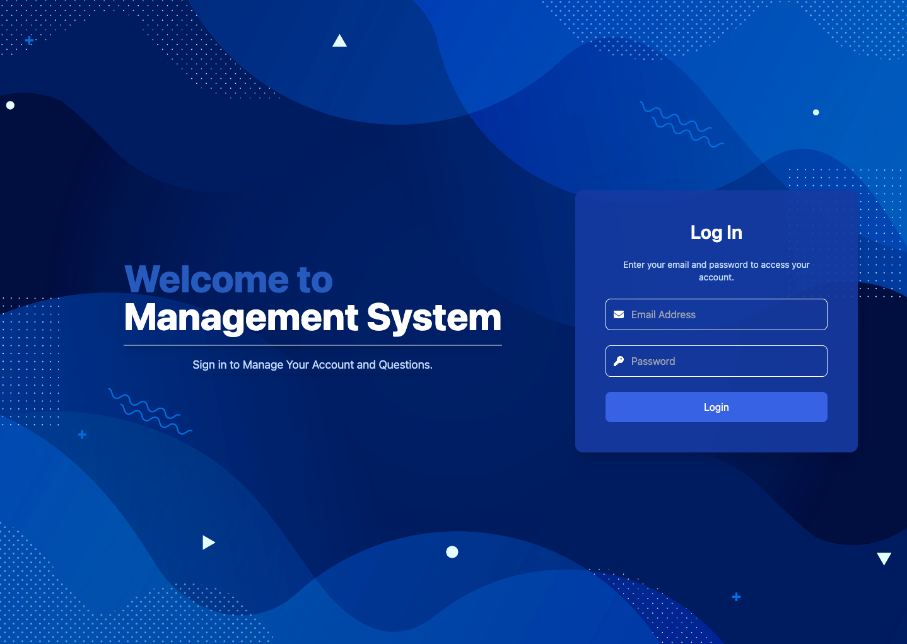

<i>Login page for admin, creator, and tester roles to securely access the system.</i>

---

### User Management (Admin Only)

#### User List

  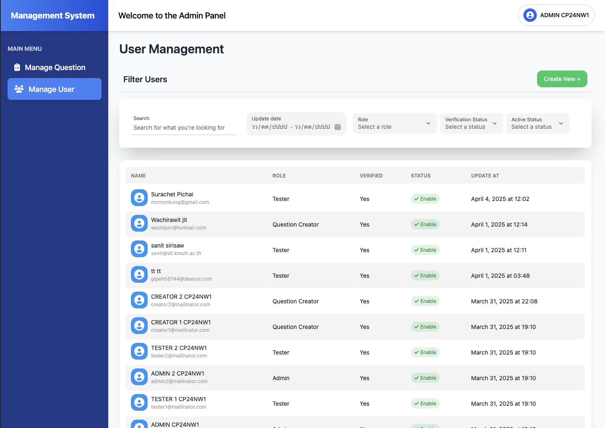

<i>Admin view: list, filter, and manage all user accounts in the system.</i>

#### View User

  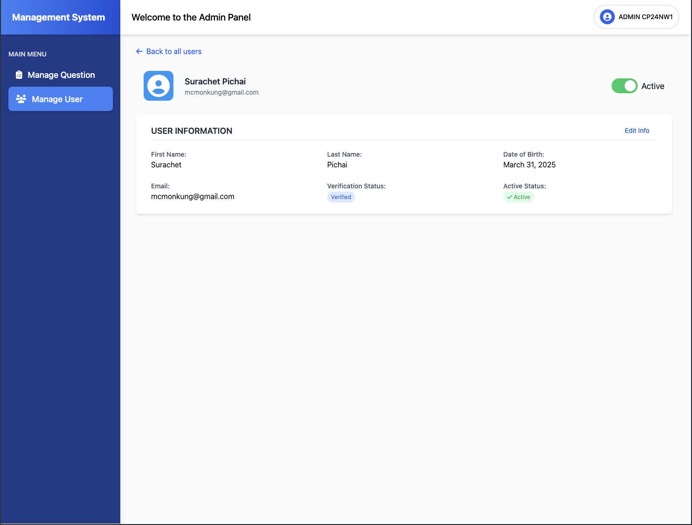

<i>Admin view: view detailed information of a specific user and change user available status (active/inactive).</i>

#### Create User

  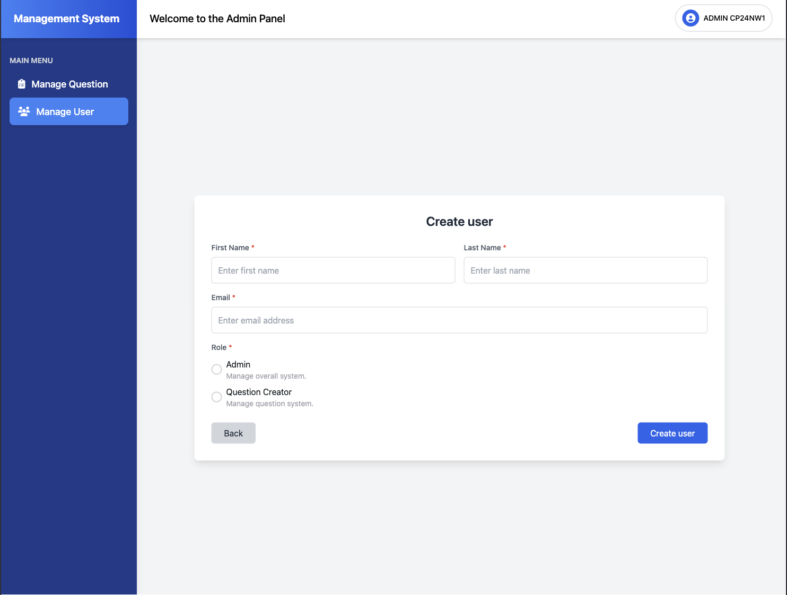

<i>Admin view: create a new user account with assigned roles.</i>

#### Edit User

  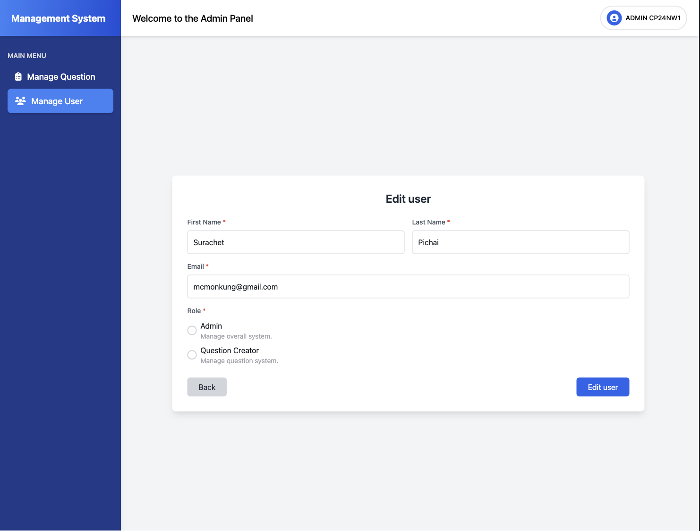

<i>Admin view: edit user account details and roles.</i>

---

### Question Management

#### Question List (Admin & Creator)

  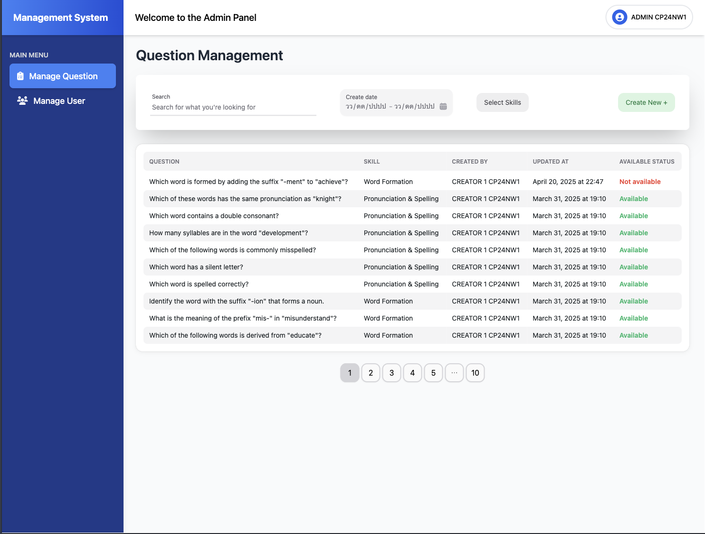

<i>
Admin view: list, filter, and manage all exam questions by question text, update date range, skill, or creator. 
Creator view: list, filter, and manage only the questions they have created (can read, update, or delete only their own questions).
</i>

#### View Question (Admin & Creator)

  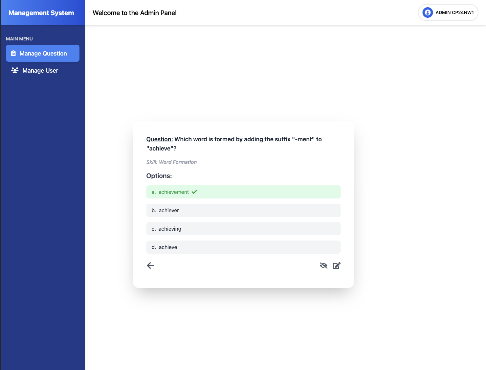

<i>
Admin/Creator view: view detailed information of an exam question and change its available status (available/not available).
</i>

#### Create Question (Admin & Creator)

  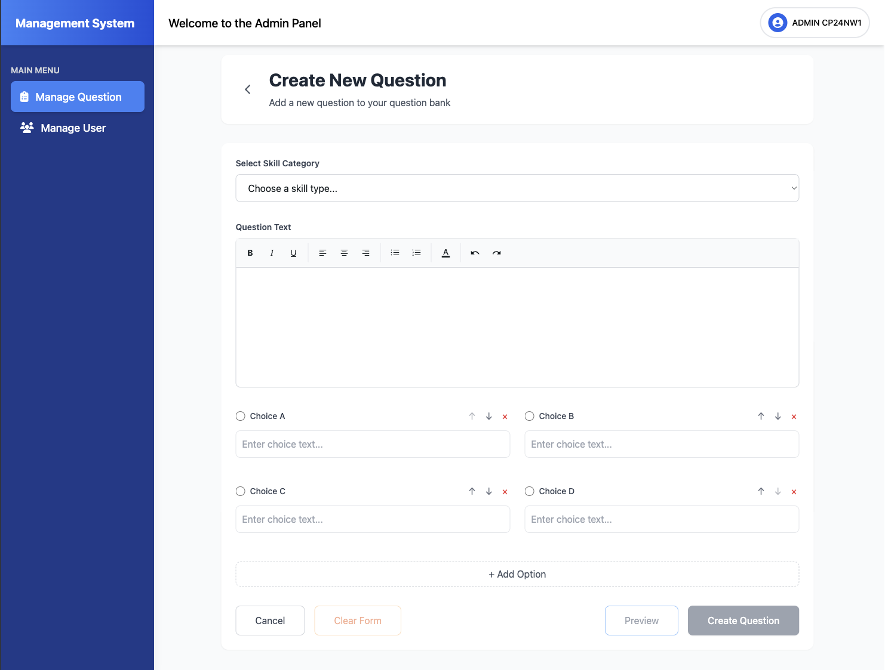

<i>
Admin/Creator view: create a new exam question with full details.
</i>

#### Edit Question (Admin & Creator)

  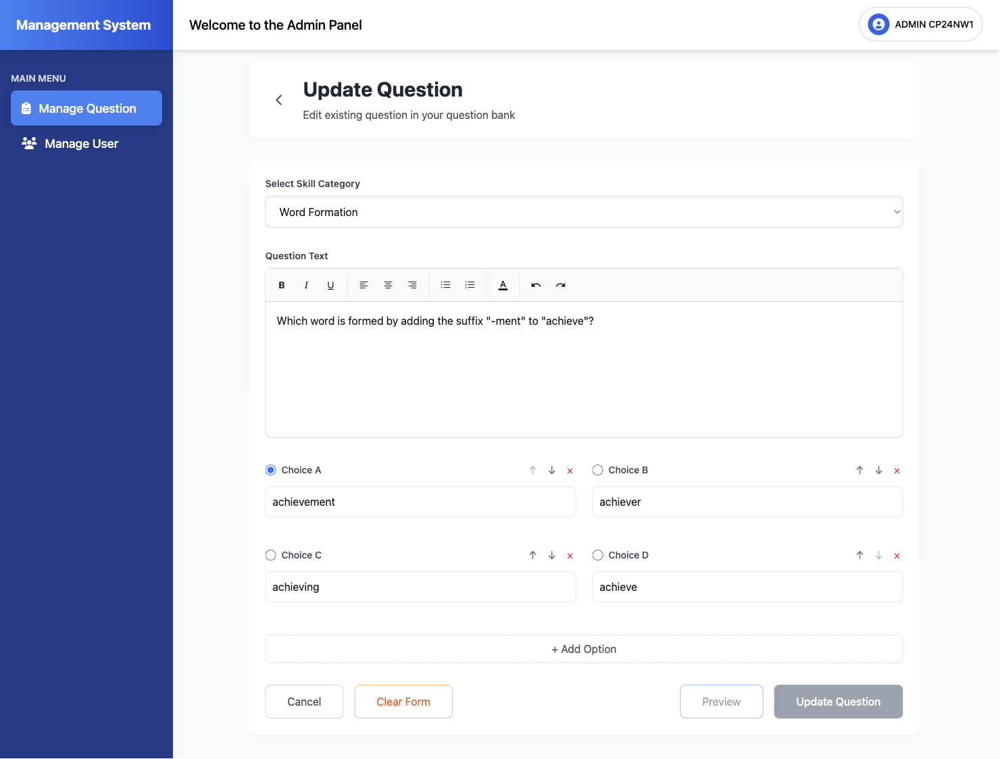

<i>
Admin/Creator view: edit details of an existing exam question (creator can edit only their own questions).
</i>

---

### Profile Page

#### Admin Profile

  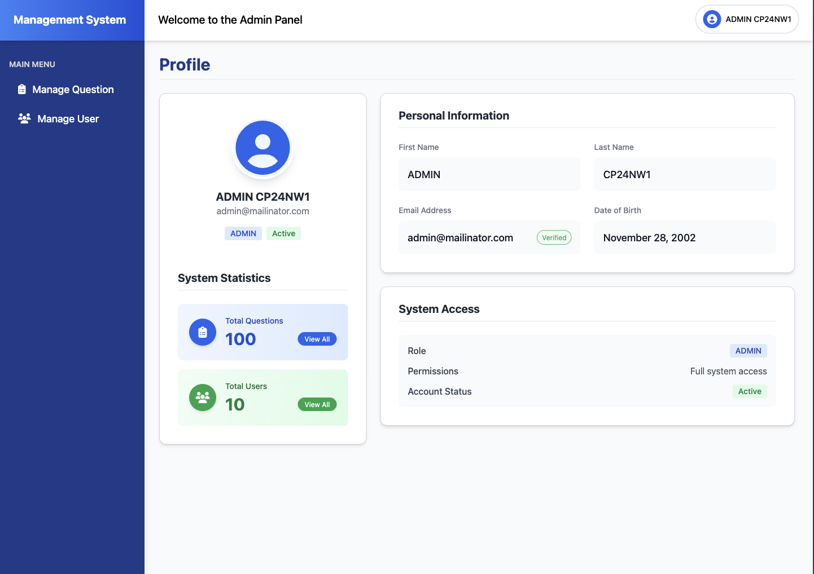

<i>Admin profile page: view and manage personal information for admin users.</i>

#### Creator Profile

  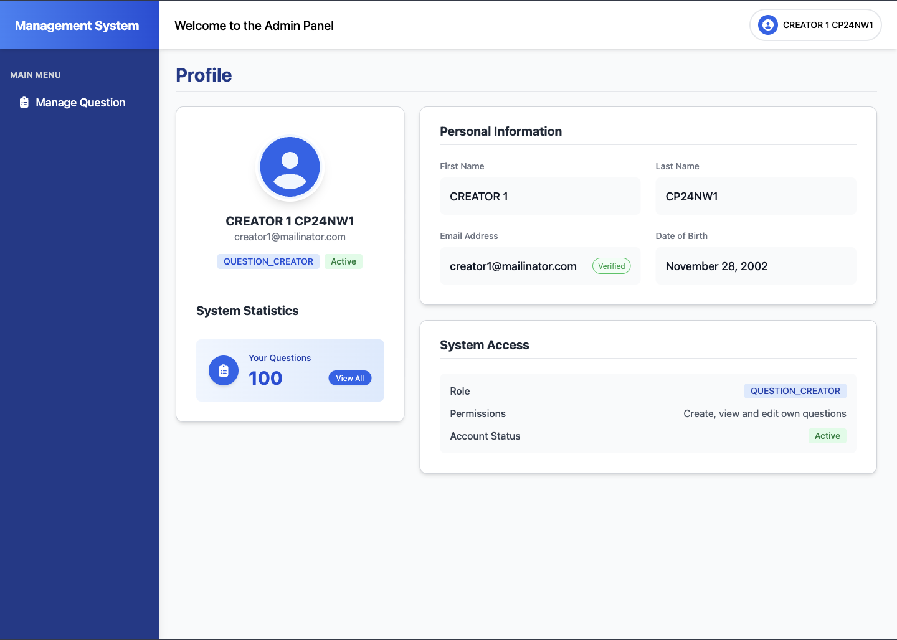

<i>Creator profile page: view and manage personal information for creator users.</i>

#### Tester Profile

  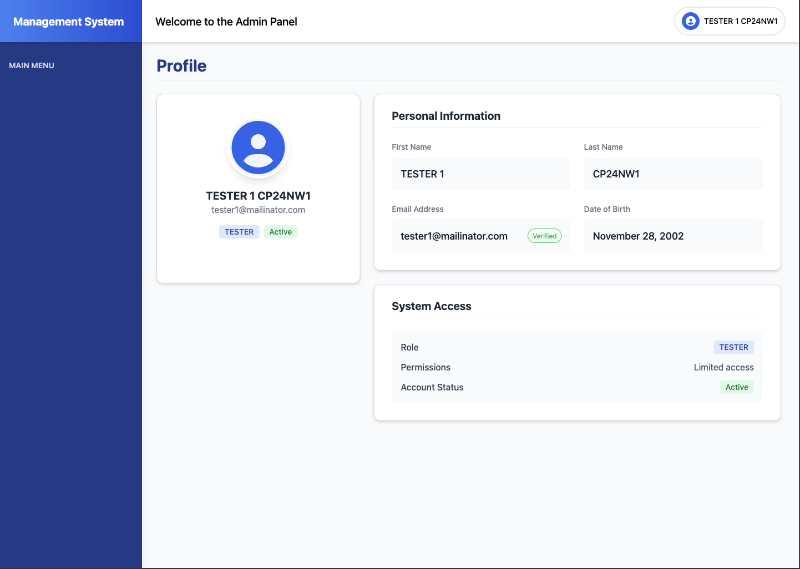

<i>Tester profile page: view and manage personal information for tester users.</i>

---

## 🗂️ Related Repositories

### User Side
- [Capstone Project – English Exam Practice Platform (User Frontend)](https://github.com/CP24NW1/web-user-front)
- [Capstone Project – English Exam Practice Platform (User Backend)](https://github.com/CP24NW1/web-user-back)

### Admin Side
- [Capstone Project – English Exam Practice Platform (Admin Backend)](https://github.com/CP24NW1/web-admin-back)

---

## 👤 Contributors

- [Surachet Pichaiwattanaporn](https://github.com/lemonz1415) (Frontend)
- [Supakorn Chat-anothai](https://github.com/64130500111) (Frontend, Backend)
- [Wachirawit Jitphitthayakul](https://github.com/wachipor2546) (DevOps)

